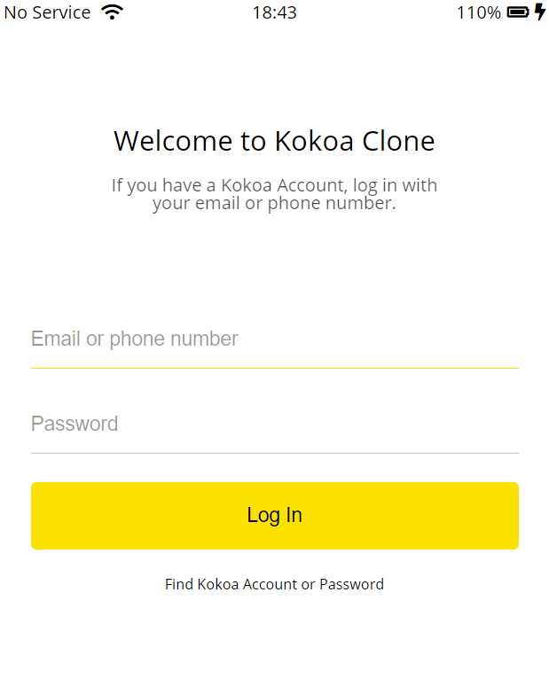

# Kokoa Clone 1
## 2021-01-18 (월)
---
## 코코아톡 클론 코딩 (#6.0 ~ #6.9)

- .gitignore 파일에 파일명을 등록하여 커밋 list에서 나타나지 않게 할 수 있다.(파일명은 꼭 .gitignore로 해야한다.)
- 대부분의 웹 서버가 디폴트로 index.html을 찾아보도록 설정되어있다.
- 클래스 이름은 겹치지 않도록 설정한다.
- 클래스 이름에 띄어쓰기가 존재하면 각각 하나로 계산됨
- 주석은 프로그래머만 볼수 있는 내용 <!---->
- BEM
  - CSS 제작 방법론, 이름 작성 방법. html요소를 block, element, modifier로 분류하여 작명한다.
    - Block
      - 독립적으로 존재하고 재사용 가능한 요소
      - 재사용을 위해 위치나 크기에 대한 값을 지정하지 않는다.
      - 태그 값이나 id를 사용하지 않고 class로 정의
      - 색상이나 크기 등을 묘사하는 이름을 사용하지 않고, 구조적으로 의미 있는 이름 사용
    - Element
      - block 안에 종속되어 기능을 담당하는 요소
      - block-name__element-name 형식으로 작명
    - Modifier
      - block이나 element의 속성
      - block-name__element-name--modifier-name 형식으로 작명
- icon 추가방법
  1. 직접 구한다.
  2. svg (픽셀이 없는 이미지 파일형식, 수학으로만 구성된 형식) 사용
     - [Heroicons](https://heroicons.dev/)
       - 원하는 아이콘을 복사 후 붙여넣기하여 사용
     - [FontAwesome](https://fontawesome.com/)
       - javascript import한 후 `<i>`태그를 이용하여 사용
```html
<!DOCTYPE html>
<html lang="en">

<head>
  <meta charset="UTF-8" />
  <meta name="viewport" content="width=device-width, initial-scale=1.0" />
  <title>Welcome to Kokoa Clone</title>
  <link rel="stylesheet" href="css/style.css">
</head>

<body>
  <div id="status-bar">
    <div class="status-bar">
      <div class="status-bar__column">
        <span>No Service</span>
        <!-- To Do: Wifi Icon -->
        <i class="fas fa-wifi"></i>
      </div>
      <div class="status-bar__column">
        <span>18:43</span>
      </div>
      <div class="status-bar__column">
        <span>110%</span>
        <!-- Battery Icon -->
        <i class="fas fa-battery-full"></i>
        <!-- Lightning Icon -->
        <i class="fas fa-bolt"></i>
      </div>
    </div>
    <header class="welcome-header">
      <h1 class="welcome-header__title">Welcome to Kokoa Clone</h1>
      <p class="welcome-header__text">
        If you have a Kokoa Account, log in with your email or phone number.
      </p>
    </header>

    <form id="login-form">
      <form action="friends.html" method="get" id="login-form">
        <input name="username" type="text" placeholder="Email or phone number" />
        <input name="password" type="password" placeholder="Password" />
        <input type="submit" value="Log In" />
        <a href="#">Find Kokoa Account or Password</a>
      </form>
      <script src="https://kit.fontawesome.com/6478f529f2.js" crossorigin="anonymous"></script>
</body>

</html>
```
```css
/* style.css */
@import "reset.css"; /* 리셋 css : 브라우저가 설정한 css를 제거 */
@import url("https://fonts.googleapis.com/css2?family=Open+Sans:wght@400;600&display=swap");
@import "variables.css";

/* Componenets */
@import "components/status-bar.css";

/* Screens */
@import "screens/login.css";

/* 모든 스타일에 적용되는 CSS */
body {
  font-family: "Open Sans", sans-serif;
}

```
```css
/* components/status-bar.css */
.status-bar { 
    display: flex;
    justify-content: center;
    padding: 5px 3px;
  }  
  .status-bar__column {
    width: 33%;
  }
  .status-bar__column:first-child span {
    margin-right: 5px;
  }
  .status-bar__column:nth-child(2) {
    display: flex;
    justify-content: center; /* 아이콘을 중앙 정렬*/
  }
  .status-bar__column:last-child {
    display: flex;
    justify-content: flex-end; /* 컬럼을 끝으로 정렬*/
    align-items: center; /* 아이콘을 중앙 정렬*/
  }
  
  .status-bar__column .fa-battery-full {
    margin: 0px 5px; /* 간격 조절*/
  }
  
```
```css
/* screens/login.css */
.welcome-header {
    margin: 90px 0px; /* status-bar와 간격 조절*/
    text-align: center; /* 텍스트 중앙정렬*/
    display: flex;
    flex-direction: column;
    align-items: center;
}
.welcome-header__title {
    margin-bottom: 20px;
    font-size: 25px;
}
.welcome-header__text {
    width: 60%;
    opacity: 0.7;
}

#login-form {
    display: flex;
    flex-direction: column;
    margin: 0px 30px; /*form 정렬*/
  }
  
  #login-form input {
    border: none; /*border 없앤다.*/
    padding: 15px 0px;
    font-size: 18px;
    margin-bottom: 25px;
  }
  
  #login-form input:not([type="submit"]) {
    border-bottom: 1px solid rgba(0, 0, 0, 0.2);
    transition: border-color 0.3s ease-in-out;
  }
  
  #login-form input::placeholder {
    color: rgba(0, 0, 0, 0.4); /* defult 구문 색 지정*/
  }
  
  #login-form input:focus {
    border-color: var(--yellow);
  }
  
  #login-form input[type="submit"] {
    background-color: var(--yellow);
    cursor: pointer;
    padding: 20px 0px;
    border-radius: 5px;
  }
  
  #login-form a {
    text-align: center;
    text-decoration: none;
    color: inherit;
    font-size: 13px;
  }
```
```css
/* reset.css */
html,
body,
div,
span,
applet,
object,
iframe,
h1,
h2,
h3,
h4,
h5,
h6,
p,
blockquote,
pre,
a,
abbr,
acronym,
address,
big,
cite,
code,
del,
dfn,
em,
img,
ins,
kbd,
q,
s,
samp,
small,
strike,
strong,
sub,
sup,
tt,
var,
b,
u,
i,
center,
dl,
dt,
dd,
ol,
ul,
li,
fieldset,
form,
label,
legend,
table,
caption,
tbody,
tfoot,
thead,
tr,
th,
td,
article,
aside,
canvas,
details,
embed,
figure,
figcaption,
footer,
header,
hgroup,
menu,
nav,
output,
ruby,
section,
summary,
time,
mark,
audio,
video {
  margin: 0;
  padding: 0;
  border: 0;
  font-size: 100%;
  font: inherit;
  vertical-align: baseline;
}
/* HTML5 display-role reset for older browsers */
article,
aside,
details,
figcaption,
figure,
footer,
header,
hgroup,
menu,
nav,
section {
  display: block;
}
body {
  line-height: 1;
}
ol,
ul {
  list-style: none;
}
blockquote,
q {
  quotes: none;
}
blockquote:before,
blockquote:after,
q:before,
q:after {
  content: "";
  content: none;
}
table {
  border-collapse: collapse;
  border-spacing: 0;
}
input:focus{
  outline: none;
}
```
```css
/* variables.css */
:root {
    --yellow: #fae100;
}
```
