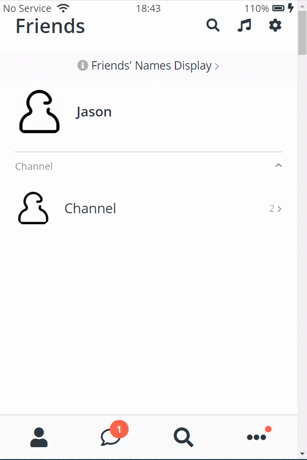

# Kokoa Clone 1
## 2021-01-19 (화)
---
## 코코아톡 클론 코딩 (#6.10 ~ #6.20)

### 실행화면


### 코드
```html
<!-- index.html -->
<!DOCTYPE html>
<html lang="en">
<head>
  <meta charset="UTF-8" />
  <meta name="viewport" content="width=device-width, initial-scale=1.0" />
  <title>Welcome to Kokoa Clone</title>
  <link rel="stylesheet" href="css/style.css">
</head>

<body>
  <div class="status-bar">
    <div class="status-bar__column">
      <span>No Service</span>
      <!-- To Do: Wifi Icon -->
      <i class="fas fa-wifi"></i>
    </div>
    <div class="status-bar__column">
      <span>18:43</span>
    </div>
    <div class="status-bar__column">
      <span>110%</span>
      <!-- Battery Icon -->
      <i class="fas fa-battery-full"></i>
      <!-- Lightning Icon -->
      <i class="fas fa-bolt"></i>
    </div>
  </div>
  
  <header class="welcome-header">
    <h1 class="welcome-header__title">Welcome to Kokoa Clone</h1>
    <p class="welcome-header__text">
      If you have a Kokoa Account, log in with your email or phone number.
    </p>
  </header>

  <form action="friends.html" method="get" id="login-form">
    <input name="username" type="text" placeholder="Email or phone number" />
    <input name="password" type="password" placeholder="Password" />
    <input type="submit" value="Log In" />
    <a href="#">Find Kokoa Account or Password</a>
  </form>
  <script src="https://kit.fontawesome.com/6478f529f2.js" crossorigin="anonymous"></script>
</body>

</html>
```
```html
<!-- friends.html -->
<!DOCTYPE html>
<html lang="en">

<head>
  <meta charset="UTF-8" />
  <meta name="viewport" content="width=device-width, initial-scale=1.0" />
  <title>Friends - Kokoa Clone</title>
  <link rel="stylesheet" href="css/style.css">
</head>

<body>
  <div class="status-bar">
    <div class="status-bar__column">
      <span>No Service</span>
      <!-- To Do: Wifi Icon -->
      <i class="fas fa-wifi"></i>
    </div>
    <div class="status-bar__column">
      <span>18:43</span>
    </div>
    <div class="status-bar__column">
      <span>110%</span>
      <!-- Battery Icon -->
      <i class="fas fa-battery-full"></i>
      <!-- Lightning Icon -->
      <i class="fas fa-bolt"></i>
    </div>
  </div>

  <header class="screen-header">
    <h1 class="screen-header__title">Friends</h1>
    <div class="screen-header__icons">
      <span><i class="fas fa-search fa-lg"></i></span>
      <span><i class="fas fa-music fa-lg"></i></span>
      <span><i class="fas fa-cog fa-lg"></i></span>
    </div>
  </header>

  <a id="friends-display-link" href="">
    <i class="fas fa-info-circle"></i> Friends' Names Display <i class="fas fa-chevron-right fa-xs"></i>
  </a>
  <main class="main-screen">
    <div class="user-component">
      <div class="user-component__column">
        
        <div class="user-component__text">
          <h4 class="user-component__title">Jason</h4>
          <!-- <h6 class="user-component__subtitle">this text whatever</h6> -->
        </div>
      </div>
      <div class="user-component__column">
      </div>
    </div>
    <div class="friends-screen__channel">
      <div class="friends-screen__channel-header">
        <span>Channel</span>
        <i class="fas fa-chevron-up fa-xs"></i>
      </div>
      <div class="user-component">
        <div class="user-component__column">
          

          <div class="user-component__text">
            <h4 class="user-component__title user-component__title--not-bold">Channel</h4>
          </div>
          <div class="user-component__column">
          </div>
        </div>

        <div class="user-component__column">
          <div>
            <span>2</span>
            <i class="fas fa-chevron-right fa-xs"></i>
          </div>
        </div>
      </div>

    </div>
  </main>

  <nav class="nav">
    <ul class="nav__list">
      <li class="nav__btn">
        <a class="nav__link" href="friends.html">
          <i class="fas fa-user fa-2x"></i>
        </a>
      </li>
      <li class="nav__btn">
        <a class="nav__link" href="chats.html">
          <span class="nav__notification badge">1</span>
          <i class="far fa-comment fa-2x"></i>
        </a>
      </li>
      <li class="nav__btn">
        <a class="nav__link" href="find.html">
          <i class="fas fa-search fa-2x"></i>
        </a>
      </li>
      <li class="nav__btn">
        <a class="nav__link" href="more.html">
          <span class="nav__notification2"></span>
          <i class="fas fa-ellipsis-h fa-2x"></i>
        </a>
      </li>
    </ul>
  </nav>

  <script src="https://kit.fontawesome.com/6478f529f2.js" crossorigin="anonymous"></script>
</body>

</html>
```
```html
<!-- chats.html -->
<!DOCTYPE html>
<html lang="en">

<head>
  <meta charset="UTF-8" />
  <meta name="viewport" content="width=device-width, initial-scale=1.0" />
  <title>Chats - Kokoa Clone</title>
  <link rel="stylesheet" href="css/style.css">
</head>

<body>
  <div class="status-bar">
    <div class="status-bar__column">
      <span>No Service</span>
      <!-- To Do: Wifi Icon -->
      <i class="fas fa-wifi"></i>
    </div>
    <div class="status-bar__column">
      <span>18:43</span>
    </div>
    <div class="status-bar__column">
      <span>110%</span>
      <!-- Battery Icon -->
      <i class="fas fa-battery-full"></i>
      <!-- Lightning Icon -->
      <i class="fas fa-bolt"></i>
    </div>
  </div>

  <header class="screen-header">
    <h1 class="screen-header__title">Chats</h1>
    <div class="screen-header__icons">
      <span><i class="fas fa-search fa-lg"></i></span>
      <span><i class="far fa-comment-dots fa-lg"></i></span>
      <span><i class="fas fa-music fa-lg"></i></span>
      <span><i class="fas fa-cog fa-lg"></i></span>
    </div>
  </header>

  <main class="main-screen">
    <div class="user-component">
      <div class="user-component__column">
        
        <div class="user-component__text">
          <h4 class="user-component__title">Jason</h4>
          <h6 class="user-component__subtitle">Please Check My Kokoa Account Info</h6>
        </div>
      </div>
      <div class="user-component__column">
          <span class="user-component__time">21:22</span>
          <div class="badge">1</div>
      </div>
    </div>
  </main>

  <nav class="nav">
    <ul class="nav__list">
      <li class="nav__btn">
        <a class="nav__link" href="friends.html">
          <i class="far fa-user fa-2x"></i>
        </a>
      </li>
      <li class="nav__btn">
        <a class="nav__link" href="chats.html">
          <span class="nav__notification badge">1</span>
          <i class="fas fa-comment fa-2x"></i>
        </a>
      </li>
      <li class="nav__btn">
        <a class="nav__link" href="find.html">
          <i class="fas fa-search fa-2x"></i>
        </a>
      </li>
      <li class="nav__btn">
        <a class="nav__link" href="more.html">
          <span class="nav__notification2"></span>
          <i class="fas fa-ellipsis-h fa-2x"></i>
        </a>
      </li>
    </ul>
  </nav>

  <script src="https://kit.fontawesome.com/6478f529f2.js" crossorigin="anonymous"></script>
</body>

</html>
```
```css
/* style.css */
@import url("https://fonts.googleapis.com/css2?family=Open+Sans:wght@400;600&display=swap");

@import "reset.css"; /* 리셋 css : 브라우저가 설정한 css를 제거 */
@import "variables.css";

/* Componenets */
@import "components/status-bar.css";
@import "components/nav-bar.css";
@import "components/screen-header.css";
@import "components/user-component.css";
@import "components/badge.css";

/* Screens */
@import "screens/login.css";
@import "screens/friends.css";

/* 모든 스타일에 적용되는 CSS */
body {
  font-family: "Open Sans", sans-serif;
  height: 1000vh;
  color: #2e363e;
}

.main-screen{
  padding: 0px var(--horizontal-space);
}
```

```css
/* variables.css */
:root {
    --yellow: #fae100;
    --horizontal-space: 25px;
}
 
```
```css
/* screens/friends.css */
#friends-display-link{
    text-align: center;
    display: block;
    background-color: #fafafa;
    padding: 15px 0;
    font-size: 18px;
    margin-bottom: 10px;
    margin-top: -15px;
}

#friends-display-link i{
    color: rgba(0,0,0,0.3);
}
.friends-screen__channel{
    margin-top: 25px;
    border-top: 1px solid rgba(0,0,0,0.2);
    padding-top: 15px;
}
.friends-screen__channel-header{
    margin-bottom: 30px;
    display: flex;
    justify-content: space-between;
    color: rgba(0,0,0,0.5);
}
```
```css
/* components/user-component.css */
.user-component{
    justify-content: space-between;
}
.user-component,
.user-component__column:first-child {
    display: flex;
    align-items: center;
}
.user-component__avatar{
    width: 70px;
    height: 70px;
    border-radius: 30px;
    margin-right: 20px;
}

.user-component__title{
    font-weight: 600;
    font-size: 22px;
}
.user-component__subtitle{
    margin-top: 8px;
    font-size: 17px;
    color: rgba(0,0,0,0.5);
}
.user-component__avatar--xl{
    width: 80px;
    height: 80px;
}
.user-component__avatar--sm{
    width: 60px;
    height: 60px;
    border-radius: 25px;
}
.user-component__title--not-bold{
    font-weight: 400;
}

.user-component__column:last-child{
    color: rgba(0, 0, 0, 0.4);
    display: flex;
    flex-direction: column;
    align-items: flex-end;
}
.user-component__time{
    margin-bottom: 10px;
    display: block;
}
```
```css
/* component/screen-header.css */
.screen-header{
    display: flex;
    justify-content: space-between;
    padding: var(--horizontal-space);
    margin-bottom: 15px;
    align-items: center;
}
.screen-header__title{
    font-size: 32px;
    font-weight: 600;
}
.screen-header__icons span{
    margin-left: 25px;
}

```
```css
/* component/badge.css */
.badge{
    background-color: tomato;
    width: 30px;
    height: 30px;
    display: flex;
    border-radius: 50%;
    justify-content: center;
    align-items: center;
    color: white;
    font-weight: 600;
}

```