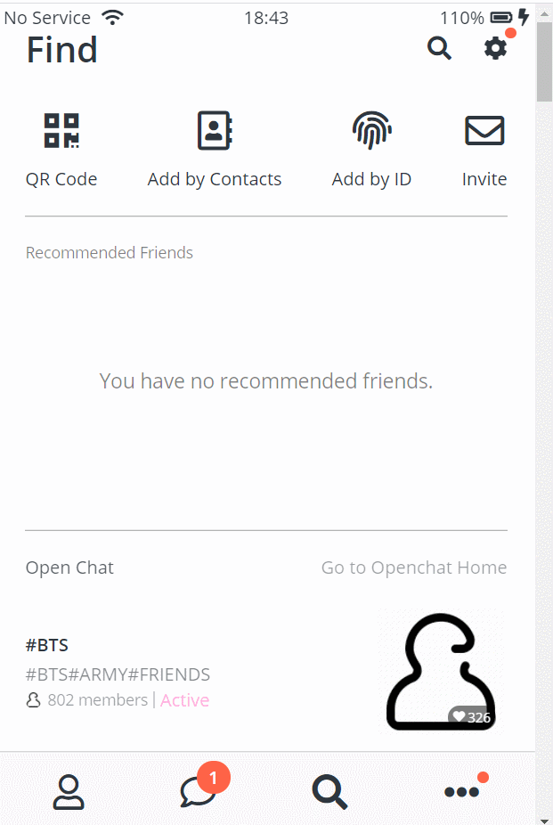

# Kokoa Clone 3
## 2021-01-25 (월)
---
## 코코아톡 클론 코딩 (#6.21 ~ #6.26)

### 실행화면


### 코드
```html
<!-- find.html -->
<!DOCTYPE html>
<html lang="en">

<head>
    <meta charset="UTF-8" />
    <meta name="viewport" content="width=device-width, initial-scale=1.0" />
    <title>Find - Kokoa Clone</title>
    <link rel="stylesheet" href="css/style.css">
</head>

<body>
    <div class="status-bar">
        <div class="status-bar__column">
            <span>No Service</span>
            <!-- To Do: Wifi Icon -->
            <i class="fas fa-wifi"></i>
        </div>
        <div class="status-bar__column">
            <span>18:43</span>
        </div>
        <div class="status-bar__column">
            <span>110%</span>
            <!-- Battery Icon -->
            <i class="fas fa-battery-full"></i>
            <!-- Lightning Icon -->
            <i class="fas fa-bolt"></i>
        </div>
    </div>

    <header class="screen-header">
        <h1 class="screen-header__title">Find</h1>
        <div class="screen-header__icons">
            <span><i class="fas fa-search fa-lg"></i></span>
            <a href="" class="nav__link">
                <span class="nav__notification3"></span>
                <span><i class="fas fa-cog fa-lg"></i></span>
            </a>
        </div>
    </header>

    <main class="main-screen">
        <div class="icon-row">
            <div class="icon-row__icon">
                <i class="fas fa-qrcode"></i>
                <span>QR Code</span>
            </div>
            <div class="icon-row__icon">
                <i class="far fa-address-book"></i>
                <span>Add by Contacts</span>
            </div>
            <div class="icon-row__icon">
                <i class="fas fa-fingerprint"></i>
                <span>Add by ID</span>
            </div>
            <div class="icon-row__icon">
                <i class="far fa-envelope"></i>
                <span>Invite</span>
            </div>
        </div>

        <div class="recommended-friends">
            <h6 class="recommended-friends__title">
                Recommended Friends
            </h6>
            <span>You have no recommended friends.</span>
        </div>
        <div class="open-chat">
            <div class="open-chat__header">
                <h4 class="open-chat__title">Open Chat</h4>
                <span>Go to Openchat Home</span>
            </div>
            <div class="open-post">
                <div class="open-post__column">
                    <h5 class="open-post__title">#BTS</h5>
                    <h6 class="open-post__hashtags">#bts#army#friends</h6>
                    <div class="open-post__members">
                        
                        <span class="open-post__member-count">802 members</span>
                        <div class="divider"></div>
                        <span class="open-post__member-status">Active</span>
                    </div>
                </div>
                <div class="open-post__column">
                    <div class="open-post__photo">
                        
                    <div class="open-post__heart-count">
                        <i class="fas fa-heart fa-xs"></i>
                        <span>326</span>
                    </div>
                    </div>
                </div>
            </div>
        </div>
    </main>

    <nav class="nav">
        <ul class="nav__list">
            <li class="nav__btn">
                <a class="nav__link" href="friends.html">
                    <i class="far fa-user fa-2x"></i>
                </a>
            </li>
            <li class="nav__btn">
                <a class="nav__link" href="chats.html">
                    <span class="nav__notification badge">1</span>
                    <i class="far fa-comment fa-2x"></i>
                </a>
            </li>
            <li class="nav__btn">
                <a class="nav__link" href="find.html">
                    <i class="fas fa-search fa-2x"></i>
                </a>
            </li>
            <li class="nav__btn">
                <a class="nav__link" href="more.html">
                    <span class="nav__notification2"></span>
                    <i class="fas fa-ellipsis-h fa-2x"></i>
                </a>
            </li>
        </ul>
    </nav>

    <script src="https://kit.fontawesome.com/6478f529f2.js" crossorigin="anonymous"></script>
</body>

</html>
```
```html
<!-- more.html -->
<!DOCTYPE html>
<html lang="en">

<head>
  <meta charset="UTF-8" />
  <meta name="viewport" content="width=device-width, initial-scale=1.0" />
  <title>More - Kokoa Clone</title>
  <link rel="stylesheet" href="css/style.css">
</head>

<body>
  <div class="status-bar">
    <div class="status-bar__column">
      <span>No Service</span>
      <!-- To Do: Wifi Icon -->
      <i class="fas fa-wifi"></i>
    </div>
    <div class="status-bar__column">
      <span>18:43</span>
    </div>
    <div class="status-bar__column">
      <span>110%</span>
      <!-- Battery Icon -->
      <i class="fas fa-battery-full"></i>
      <!-- Lightning Icon -->
      <i class="fas fa-bolt"></i>
    </div>
  </div>

  <header class="screen-header">
    <h1 class="screen-header__title">Chats</h1>
    <div class="screen-header__icons">
      <span><i class="fas fa-search fa-lg"></i></span>
      <span><i class="fas fa-music fa-lg"></i></span>
      <span><a href="settings.html"><i class="fas fa-cog fa-lg"></i></a></span>
    </div>
  </header>

  <main class="main-screen more-screen">
    <div class="user-component">
        <div class="user-component__column">
          
          <div class="user-component__text">
            <h4 class="user-component__title">Jason</h4>
            <h6 class="user-component__subtitle">+ 123 456 7890 <span class="user-component__info">i</span></h6>
          </div>
        </div>
        <div class="user-component__column">
            <i class="far fa-comment-alt fa-2x"></i>
        </div>
      </div>
      <div class="icon-row">
        <div class="icon-row__icon">
            <i class="fas fa-calendar"></i>
            <span>Calendar</span>
        </div>
        <div class="icon-row__icon">
            <i class="far fa-smile-beam"></i>
            <span>Emoticons</span>
        </div>
        <div class="icon-row__icon">
            <i class="fas fa-paint-roller"></i>
            <span>Theme</span>
        </div>
        <div class="icon-row__icon">
            <i class="fas fa-file-invoice-dollar"></i>
            <span>Account</span>
        </div>
    </div>
    <div class="more-suggestions">
        <h4 class="more-suggestions__title">Suggestions</h4>
        <div class="more-suggestions__icons">
            <div class="more-suggestions__icon">
                <div class="more-suggestions__icon-image">
                    <i class="fas fa-quote-right"></i>
                </div>
                <span class="more-suggestions__icon-text">
                    Kokoa Story
                </span>
            </div>
            <div class="more-suggestions__icon">
                <div class="more-suggestions__icon-image">
                    <i class="fas fa-quote-right"></i>
                </div>
                <span class="more-suggestions__icon-text">
                    Kokoa Story
                </span>
            </div>
        </div>
    </div>
  </main>

  <nav class="nav">
    <ul class="nav__list">
      <li class="nav__btn">
        <a class="nav__link" href="friends.html">
          <i class="far fa-user fa-2x"></i>
        </a>
      </li>
      <li class="nav__btn">
        <a class="nav__link" href="chats.html">
          <span class="nav__notification badge">1</span>
          <i class="far fa-comment fa-2x"></i>
        </a>
      </li>
      <li class="nav__btn">
        <a class="nav__link" href="find.html">
          <i class="fas fa-search fa-2x"></i>
        </a>
      </li>
      <li class="nav__btn">
        <a class="nav__link" href="more.html">
          <span class="nav__notification2"></span>
          <i class="fas fa-ellipsis-h fa-2x"></i>
        </a>
      </li>
    </ul>
  </nav>

  <script src="https://kit.fontawesome.com/6478f529f2.js" crossorigin="anonymous"></script>
</body>

</html>
```

```css
/* style.css */
@import url("https://fonts.googleapis.com/css2?family=Open+Sans:wght@400;600&display=swap");

@import "reset.css"; /* 리셋 css : 브라우저가 설정한 css를 제거 */
@import "variables.css";

/* Componenets */
@import "components/status-bar.css";
@import "components/nav-bar.css";
@import "components/screen-header.css";
@import "components/user-component.css";
@import "components/badge.css";
@import "components/icon-row.css";

/* Screens */
@import "screens/login.css";
@import "screens/friends.css";
@import "screens/find.css";
@import "screens/more.css";

/* 모든 스타일에 적용되는 CSS */
body {
  font-family: "Open Sans", sans-serif;
  height: 1000vh;
  color: #2e363e;
}

.main-screen{
  padding: 0px var(--horizontal-space);
}
```

```css
/* variables.css */
:root {
    --yellow: #fae100;
    --horizontal-space: 25px;
    --main-border: 1px solid rgba(0,0,0,0.3);
}
 
 
```
```css
/* screens/find.css */
.recommended-friends{
    margin: 25px 0;
    padding: 25px 0;
    border-top: var(--main-border);
    border-bottom: var(--main-border);
}

.recommended-friends__title{
    font-size: 14px;
    color: rgba(0,0,0,0.5);
}

.recommended-friends span{
    margin: 100px 0;
    display: block;
    text-align: center;
    font-size: 18px;
    color: rgba(0,0,0,0.5);
}
.open-chat__header{
    display: flex;
    justify-content: space-between;
    opacity: 0.8;
    margin-bottom: 25px;
}

.open-chat__header span{
    opacity: 0.6;
}

.open-post{
    display: flex;
    justify-content: space-between;
    align-items: center;
}

.open-post__title{
    font-weight: 600;
    margin-bottom: 10px;
}

.open-post__hashtags{
    text-transform: uppercase;
    opacity: 0.6;
}

.open-post__members{
    display: flex;
    align-items: center;
    margin-top: 7px;
}

.open-post__members img{
    width: 15px;
    height: 15px;
    border-radius: 50%;
    margin-right: 5px;
}

.open-post__member-count{
    opacity: 0.5;
    font-size: 14px;
}

.open-post__members .divider{
    width: 1px;
    height: 15px;
    margin: 0 5px;
    background-color: rgba(0,0,0,0.2);
}

.open-post__member-status{
    color: #ffb0e0;
}

.open-post__photo{
    position: relative;
}

.open-post__photo img{
    width: 120px;
    height: 120px;
    border-radius: 10px;
}

.open-post__heart-count{
    background-color: rgba(0,0,0,0.5);
    color: white;
    padding: 5px;
    border-radius: 20px;
    display: flex;
    align-items: center;
    position: absolute;
    bottom: 10px;
    right: 10px;
    font-size: 12px;
}

.open-post__heart-count span{
    margin-left: 3px;
}
```
```css
/* more.css */
.more-screen .icon-row{
    margin-top: 35px;
}

.more-suggestions{
    margin-top: 40px;
    border-top: var(--main-border);
    padding-top: 40px;
}

.more-suggestions__title{
    margin-bottom: 30px;
}

.more-suggestions__icons{
    display: flex;
}
.more-suggestions__icon{
    margin-right: 30px;
    display: flex;
    flex-direction: column;
    align-items: center;
}

.more-suggestions__icon-image{
    width: 60px;
    height: 60px;
    background-color: var(--yellow);
    border-radius: 10px;
    display: flex;
    justify-content: center;
    align-items: center;
    margin-bottom: 10px;
}

.more-suggestions__icon-image i{
    font-size: 32px;
    color: white;

}
```

```css
/* components/icons-row.css */
.icon-row{
    display: flex;
    justify-content: space-between;
}

.icon-row__icon{
    display: flex;
    flex-direction: column;
    align-items: center;
}

.icon-row__icon i{
    font-size: 35px;
}

.icon-row__icon span{
    margin-top: 18px;
}


```
