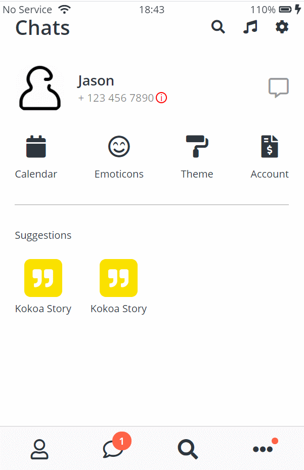

# Kokoa Clone 4
## 2021-02-02 (화)
---
## 코코아톡 클론 코딩 (#6.27 ~ #6.33)

### 실행화면


```html
<!-- settings.html -->
<!DOCTYPE html>
<html lang="en">

<head>
  <meta charset="UTF-8" />
  <meta name="viewport" content="width=device-width, initial-scale=1.0" />
  <title>Settings - Kokoa Clone</title>
  <link rel="stylesheet" href="css/style.css">
</head>

<body>
  <div class="status-bar">
    <div class="status-bar__column">
      <span>No Service</span>
      <!-- To Do: Wifi Icon -->
      <i class="fas fa-wifi"></i>
    </div>
    <div class="status-bar__column">
      <span>18:43</span>
    </div>
    <div class="status-bar__column">
      <span>110%</span>
      <!-- Battery Icon -->
      <i class="fas fa-battery-full"></i>
      <!-- Lightning Icon -->
      <i class="fas fa-bolt"></i>
    </div>
  </div>

  <header class="alt-header">
    <div class="alt-header__column">
      <a href="more.html">
        <i class="fas fa-angle-left fa-3x"></i>
      </a>
    </div>
    <div class="alt-header__column">
      <h1 class="alt-geader__title">Settings</h1>
    </div>
    <div class="alt-header__column">
      <span><i class="fas fa-search fa-2x"></i></span>
    </div>
  </header>

  <main class="main-screen more-screen">
    <ul class="setting-list">
      <li class="settings__setting">
        <div class="settings__setting-column">
          <i class="fas fa-bullhorn"></i>
          <span>Notices</span>
        </div>
        <div class="settings__setting-column"></div>
      </li>
      <li class="settings__setting">
        <div class="settings__setting-column">
          <i class="fas fa-flask"></i>
          <span>Kokoa Lab</span>
        </div>
        <div class="settings__setting-column"></div>
      </li>
      <li class="settings__setting">
        <div class="settings__setting-column">
          <i class="fas fa-info-circle"></i>
          <span>Version</span>
        </div>
        <div class="settings__setting-column">Latest Version</div>
      </li>
    </ul>
  </main>

  <nav class="nav">
    <ul class="nav__list">
      <li class="nav__btn">
        <a class="nav__link" href="friends.html">
          <i class="far fa-user fa-2x"></i>
        </a>
      </li>
      <li class="nav__btn">
        <a class="nav__link" href="chats.html">
          <span class="nav__notification badge">1</span>
          <i class="far fa-comment fa-2x"></i>
        </a>
      </li>
      <li class="nav__btn">
        <a class="nav__link" href="find.html">
          <i class="fas fa-search fa-2x"></i>
        </a>
      </li>
      <li class="nav__btn">
        <a class="nav__link" href="more.html">
          <span class="nav__notification2"></span>
          <i class="fas fa-ellipsis-h fa-2x"></i>
        </a>
      </li>
    </ul>
  </nav>

  <script src="https://kit.fontawesome.com/6478f529f2.js" crossorigin="anonymous"></script>
</body>

</html>
```
```html
<!-- chat.html -->
<!DOCTYPE html>
<html lang="en">

<head>
  <meta charset="UTF-8" />
  <meta name="viewport" content="width=device-width, initial-scale=1.0" />
  <title>Chat w/ Nico - Kokoa Clone</title>
  <link rel="stylesheet" href="css/style.css">
</head>

<body id="chat-screen">
  <div class="status-bar">
    <div class="status-bar__column">
      <span>No Service</span>
      <!-- To Do: Wifi Icon -->
      <i class="fas fa-wifi"></i>
    </div>
    <div class="status-bar__column">
      <span>18:43</span>
    </div>
    <div class="status-bar__column">
      <span>110%</span>
      <!-- Battery Icon -->
      <i class="fas fa-battery-full"></i>
      <!-- Lightning Icon -->
      <i class="fas fa-bolt"></i>
    </div>
  </div>

  <header class="alt-header">
    <div class="alt-header__column">
      <a href="chats.html">
        <i class="fas fa-angle-left fa-3x"></i>
      </a>
    </div>
    <div class="alt-header__column">
      <h1 class="alt-header__title">니꼬</h1>
    </div>
    <div class="alt-header__column">
      <span><i class="fas fa-search fa-lg"></i></span>
      <span><i class="fas fa-bars fa-lg"></i></span>
    </div>
  </header>

  <main class="main-screen main-chat">
    <div class="chat__timestamp">
        Monday, February 2, 2020
    </div>

    <div class="message-row">
        
        <div class="message-row__conteant">
            <span class="message__author">니꼬</span>
            <div class="message__info">
                <span class="message__bubble">Hi!</span>
                <span class="message__time">21:27</span>
            </div>
        </div>
    </div>
  
    <div class="message-row message-row__own">
        <div class="message-row__conteant">
            <div class="message__info">
                <span class="message__bubble">Hi Nice to meet you!</span>
                <span class="message__time">21:27</span>
            </div>
        </div>
    </div>
  </main>

  <form class="reply">
    <div class="reply__column">
        <i class="far fa-plus-square fa-lg"></i>
    </div>
    <div class="reply__column">
        <input type="text" placeholder="Write a message...">
        <i class="far fa-smile-wink fa-lg"></i>
        <button>
            <i class="fas fa-arrow-up"></i>
        </button>
    </div>
  </form>

  <script src="https://kit.fontawesome.com/6478f529f2.js" crossorigin="anonymous"></script>
</body>

</html>
```
```css
/* settings.css */
.settings__setting{
    padding: 20px 0;
    border-bottom: 1px solid rgba(0,0,0,0.1);
    font-size: 20px;
    display: flex;
    align-items: center;
    justify-content: space-between;
}

.settings__setting i{
    margin-right: 20px;
    font-size: 22px;
    opacity: 0.8;
}

.settings__setting-column:last-child{
    opacity: 0.5;
}
```
```css
/* chat.css */
#chat-screen{
    background-color: #abc1d1;
    height: 11000vh;
}

#chat-screen .alt-header, #chat-screen .status-bar{
    top: 0;
    position: fixed;
    width: 100%;
    box-sizing: border-box;
    background-color: #abc1d1;
    z-index: 1;
}

#chat-screen .status-bar{
    z-index: 2;
}

.main-chat{
    margin-top: 120px;
    display: flex;
    flex-direction: column;
    align-items: center;
}

.chat__timestamp{
    color: white;
    background-color: #92a4b2;
    padding: 15px;
    border-radius: 25px;
    margin-bottom: 25px;
}

.message-row{
    width: 100%;
    display: flex;
    margin-bottom: 25px;
}

.message-row img{
    width: 50px;
    height: 50px;
    border-radius: 50%;
    margin-right: 15px;
}

.message__author{
    margin-bottom: 5px;
    display: block;
}

.message__bubble{
    background-color: white;
    padding: 13px;
    border-radius: 18px;
    border-top-left-radius: 0px;
    margin-right: 5px;
}

.message__info{
    display: flex;
    align-items: flex-end;
}

.message__time,
.message__author{
    opacity: 0.8;
    font-size: 13px;
}

.message-row__own{
    justify-content: flex-end;
}

.message-row__own .message__bubble{
    background-color: var(--yellow);
    border-top-right-radius: 0;
    border-top-left-radius: 15px;
    margin-right: 0;
    margin-left: 5px;
}

.message-row__own .message__info{
    flex-direction: row-reverse;
}

.reply{
    position: fixed;
    bottom: 0;
    width: 100%;
    background-color: white;
    display: flex;
    justify-content: space-between;
    padding: 5px 25px;
    align-items: center;
    box-sizing: border-box;
}
.reply .reply__column:first-child{
    width: 10%;
}
.reply .reply__column:last-child{
    width: 90%;
    position: relative;
}
.reply input{
    padding: 0 12px;
    height: 30px;
    width: 100%;
    border: var(--main-border);
    border-radius: 20px;
}

.reply__column:last-child > i,
.reply__column:last-child button{
    position: absolute;
    right: -3.5px;
    top: 2px;
}

.reply__column:last-child > i{
    right: 40px;
    top: 9px;
}

.reply__column button{
    background-color: var(--yellow);
    border: none;
    border-radius: 50%;
    width: 30px;
    height: 30px;
}

.reply__column button:focus,
.reply__column button:active{
    outline: none;
}

.reply i {
    opacity: 0.5;
}

.reply__column button i{
    opacity: 1;
}
```
```css
/* alt-screen-header.css */
.alt-header {
    padding: var(--horizontal-space);
    margin-bottom: 15px;
    display: flex;
    align-items: center;
    justify-content: center;
}

.alt-header__title{
    font-size: 32px;
    font-weight: 600;
}

.alt-header__column:first-child{
    margin-right: auto;
}
.alt-header__column:last-child{
    margin-left: auto;
    display: flex;
    justify-content: flex-end;
}
.alt-header__column:nth-child(2){
    text-align: center;
}

.alt-header__column span:last-child{
    margin-left: 20px;
}

.alt-header__column{
    width: 33%;
}
```
```css
/* style.css */
@import url("https://fonts.googleapis.com/css2?family=Open+Sans:wght@400;600&display=swap");

@import "reset.css"; /* 리셋 css : 브라우저가 설정한 css를 제거 */
@import "variables.css";

/* Componenets */
@import "components/status-bar.css";
@import "components/nav-bar.css";
@import "components/screen-header.css";
@import "components/user-component.css";
@import "components/badge.css";
@import "components/icon-row.css";
@import "components/alt-screen-header.css";

/* Screens */
@import "screens/login.css";
@import "screens/friends.css";
@import "screens/find.css";
@import "screens/more.css";
@import "screens/settings.css";
@import "screens/chat.css";

/* 모든 스타일에 적용되는 CSS */
body {
  font-family: "Open Sans", sans-serif;
  height: 1000vh;
  color: #2e363e;
}

.main-screen{
  padding: 0px var(--horizontal-space);
}
```