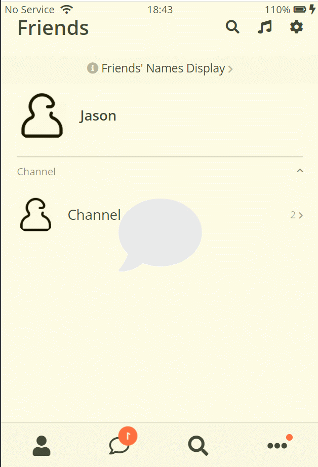

# Kokoa Clone 4
## 2021-02-07 (일)
---
## 코코아톡 클론 코딩 (#6.34 ~ #7)

### 실행화면


``` html
<!-- friends.html 제일 아래 no-mobile 추가 -->
<!DOCTYPE html>
<html lang="en">

<head>
  <meta charset="UTF-8" />
  <meta name="viewport" content="width=device-width, initial-scale=1.0" />
  <title>Friends - Kokoa Clone</title>
  <link rel="stylesheet" href="css/style.css">
</head>

<body>
  <div class="status-bar">
    <div class="status-bar__column">
      <span>No Service</span>
      <!-- To Do: Wifi Icon -->
      <i class="fas fa-wifi"></i>
    </div>
    <div class="status-bar__column">
      <span>18:43</span>
    </div>
    <div class="status-bar__column">
      <span>110%</span>
      <!-- Battery Icon -->
      <i class="fas fa-battery-full"></i>
      <!-- Lightning Icon -->
      <i class="fas fa-bolt"></i>
    </div>
  </div>

  <header class="screen-header">
    <h1 class="screen-header__title">Friends</h1>
    <div class="screen-header__icons">
      <span><i class="fas fa-search fa-lg"></i></span>
      <span><i class="fas fa-music fa-lg"></i></span>
      <span><i class="fas fa-cog fa-lg"></i></span>
    </div>
  </header>

  <a id="friends-display-link" href="">
    <i class="fas fa-info-circle"></i> Friends' Names Display <i class="fas fa-chevron-right fa-xs"></i>
  </a>
  <main class="main-screen">
    <div class="user-component">
      <div class="user-component__column">
        
        <div class="user-component__text">
          <h4 class="user-component__title">Jason</h4>
          <!-- <h6 class="user-component__subtitle">this text whatever</h6> -->
        </div>
      </div>
      <div class="user-component__column">
      </div>
    </div>
    <div class="friends-screen__channel">
      <div class="friends-screen__channel-header">
        <span>Channel</span>
        <i class="fas fa-chevron-up fa-xs"></i>
      </div>
      <div class="user-component">
        <div class="user-component__column">
          

          <div class="user-component__text">
            <h4 class="user-component__title user-component__title--not-bold">Channel</h4>
          </div>
          <div class="user-component__column">
          </div>
        </div>

        <div class="user-component__column">
          <div>
            <span>2</span>
            <i class="fas fa-chevron-right fa-xs"></i>
          </div>
        </div>
      </div>

    </div>
  </main>

  <nav class="nav">
    <ul class="nav__list">
      <li class="nav__btn">
        <a class="nav__link" href="friends.html">
          <i class="fas fa-user fa-2x"></i>
        </a>
      </li>
      <li class="nav__btn">
        <a class="nav__link" href="chats.html">
          <span class="nav__notification badge">1</span>
          <i class="far fa-comment fa-2x"></i>
        </a>
      </li>
      <li class="nav__btn">
        <a class="nav__link" href="find.html">
          <i class="fas fa-search fa-2x"></i>
        </a>
      </li>
      <li class="nav__btn">
        <a class="nav__link" href="more.html">
          <span class="nav__notification2"></span>
          <i class="fas fa-ellipsis-h fa-2x"></i>
        </a>
      </li>
    </ul>
  </nav>
  <div id="splash-screen">
    <i class="fas fa-comment"></i>
  </div>

  <div id="no-mobile">
    <span>Your screen is too big ㅠㅠ</span>
  </div>

  <script src="https://kit.fontawesome.com/6478f529f2.js" crossorigin="anonymous"></script>
</body>

</html>
```

``` css
/* no-mobile.css */
#no-mobile{
    position: absolute;
    z-index: 99;
    height: 100vh;
    width: 100vw;
    background-color: var(--yellow);
    display: flex;
    top: 0;
    justify-content: center;
    align-items: center;
    font-size: 32px;
}

@media screen and (max-width: 645px){
    #no-mobile{
        display: none;
    }
}
```

``` css
/* friends.css @keyframe 추가 */
#friends-display-link{
    text-align: center;
    display: block;
    background-color: #fafafa;
    padding: 15px 0;
    font-size: 18px;
    margin-bottom: 10px;
    margin-top: -15px;
}

#friends-display-link i{
    color: rgba(0,0,0,0.3);
}
.friends-screen__channel{
    margin-top: 25px;
    border-top: var(--main-border);
    padding-top: 15px;
}
.friends-screen__channel-header{
    margin-bottom: 30px;
    display: flex;
    justify-content: space-between;
    color: rgba(0,0,0,0.5);
}

@keyframes hideSplashScreen{
    form{
        opacity: 1;
    }
    to{
        opacity: 0;
        visibility: hidden;
    }
}

#splash-screen{
    background-color: var(--yellow);
    position: absolute;
    height: 100vh;
    width: 100vw;
    top: 0;
    display: flex;
    justify-content: center;
    align-items: center;
    font-size: 132px;
    animation: hideSplashScreen 0.3s ease-in-out forwards;
    animation-delay: 2s;
}
```

``` css
/* chat.css @keyframe 추가 */
#chat-screen{
    background-color: #abc1d1;
    height: 550vh;
}

#chat-screen .alt-header, #chat-screen .status-bar{
    top: 0;
    position: fixed;
    width: 100%;
    box-sizing: border-box;
    background-color: #abc1d1;
    z-index: 1;
}

#chat-screen .status-bar{
    z-index: 2;
}

@keyframes fadeIn{
    from{
        transform: translateY(30px);
        opacity: 0;
    }
    to{
        transform: none;
        opacity: 1;
    }
}

.main-chat{
    margin-top: 120px;
    display: flex;
    flex-direction: column;
    align-items: center;
    animation : fadeIn 0.3s linear;
}

.chat__timestamp{
    color: white;
    background-color: #92a4b2;
    padding: 15px;
    border-radius: 25px;
    margin-bottom: 25px;
}

.message-row{
    width: 100%;
    display: flex;
    margin-bottom: 25px;
}

.message-row img{
    width: 50px;
    height: 50px;
    border-radius: 50%;
    margin-right: 15px;
}

.message__author{
    margin-bottom: 5px;
    display: block;
}

.message__bubble{
    background-color: white;
    padding: 13px;
    border-radius: 18px;
    border-top-left-radius: 0px;
    margin-right: 5px;
}

.message__info{
    display: flex;
    align-items: flex-end;
}

.message__time,
.message__author{
    opacity: 0.8;
    font-size: 13px;
}

.message-row__own{
    justify-content: flex-end;
}

.message-row__own .message__bubble{
    background-color: var(--yellow);
    border-top-right-radius: 0;
    border-top-left-radius: 15px;
    margin-right: 0;
    margin-left: 5px;
}

.message-row__own .message__info{
    flex-direction: row-reverse;
}

.reply{
    position: fixed;
    bottom: 0;
    width: 100%;
    background-color: white;
    display: flex;
    justify-content: space-between;
    padding: 5px 25px;
    align-items: center;
    box-sizing: border-box;
    transition: all .3s ease-in-out;
}
.reply .reply__column:first-child{
    width: 10%;
}
.reply .reply__column:last-child{
    width: 90%;
    position: relative;
}
.reply input{
    padding: 0 12px;
    height: 30px;
    width: 100%;
    border: var(--main-border);
    border-radius: 20px;
    box-sizing: border-box;
    transition: all .3s ease-in-out;
}

.reply__column:last-child > i,
.reply__column:last-child button{
    position: absolute;
    right: -3.5px;
    top: 2px;
}

.reply__column:last-child > i{
    right: 40px;
    top: 9px;
}

.reply__column button{
    background-color: var(--yellow);
    border: none;
    border-radius: 50%;
    width: 30px;
    height: 30px;
}

.reply__column button:focus,
.reply__column button:active{
    outline: none;
}

.reply i {
    opacity: 0.5;
}

.reply__column button i{
    opacity: 1;
}

.reply .reply__column:first-child,
.reply .fa-smile-wink,
.reply button{
    transition: opacity .3s ease-in-out;
}

.reply:focus-within .reply__column:first-child,
.reply:focus-within .fa-smile-wink,
.reply:focus-within button{
    opacity: 0;
}

.reply input:focus{
    width: 98vw;
    transform: translateX(-13%) translateY(-80px);
}

.reply:focus-within{
    transform: translateY(80px);
}
```